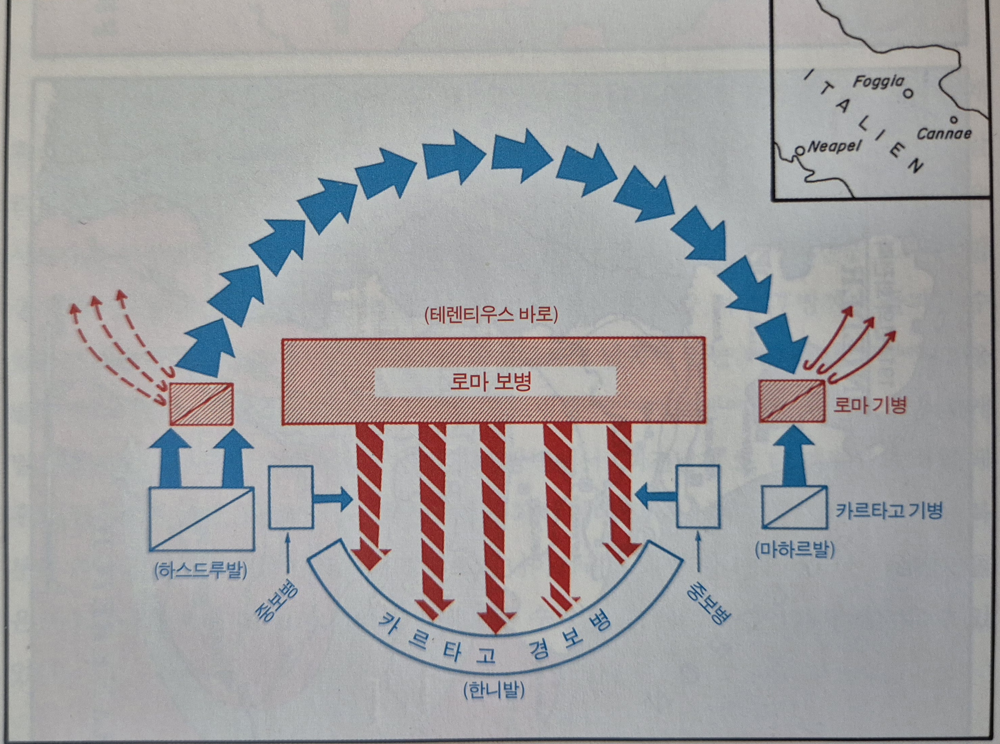
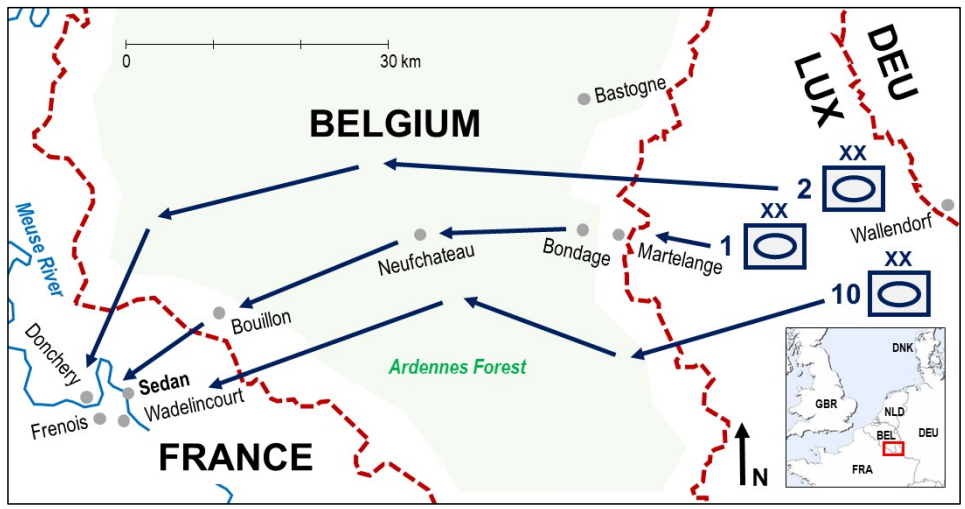
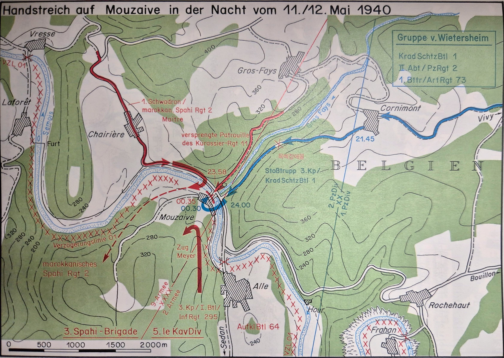
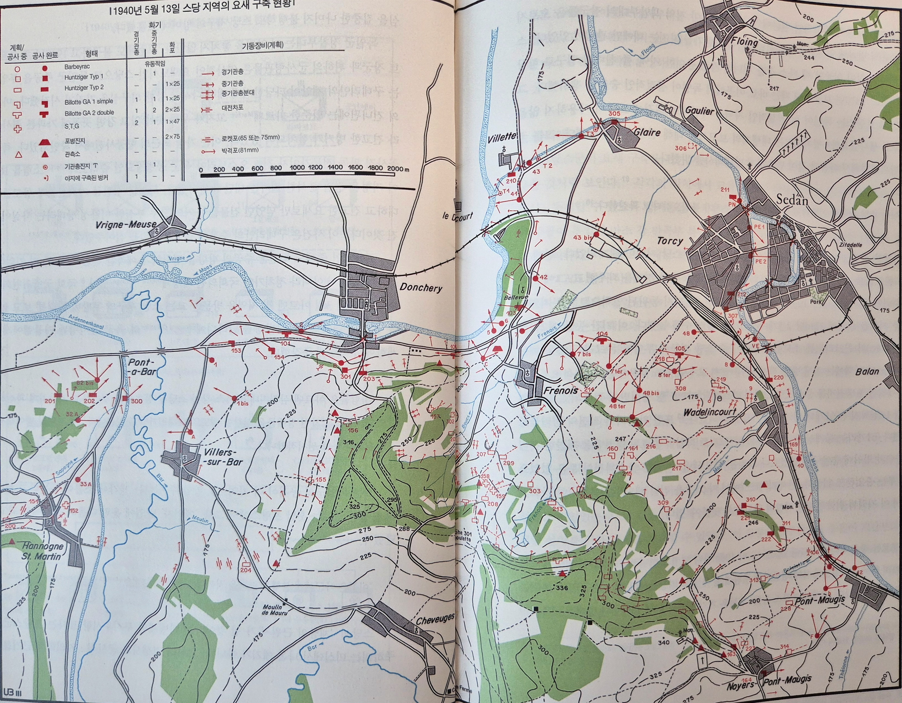
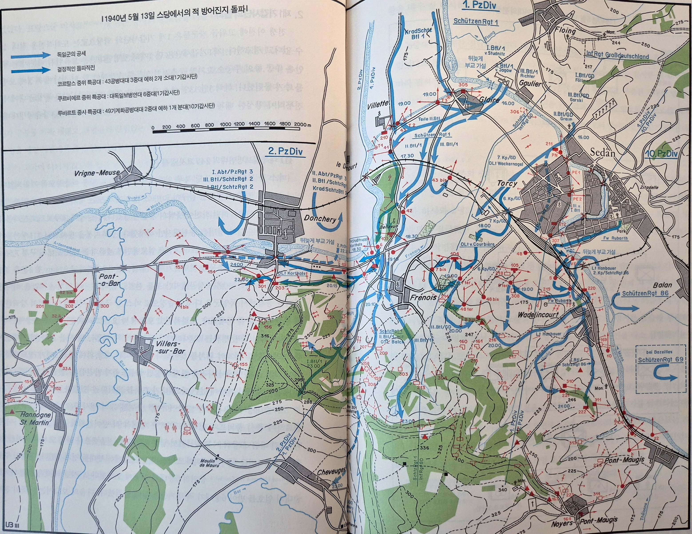

# 전격전의 전설

Blitzkrieg(블리츠크릭), lightning war

2차 세계대전 초반, 독일의 속전속결 전역을 가리키는 말.

특히, 독일의 폴란드 침공 이후, 1940년 5월 독일이 4일만에 프랑스 방어선을 돌파하고 6주만에 종결된 전역(Campaign)을 의미한다.

| 구분  | 영어 표현           | 초점                                           | 대표 범위          | 기업 비유                                              |
| --- | --------------- | -------------------------------------------- | -------------- | -------------------------------------------------- |
| 전략  | Strategy        | **목표와 방향: What / Why**                       | 전쟁 (War)      | CEO가 향후 5년 내 업계 1위라는 목표와 자원 배분 방향을 정함              |
| 작전술 | Operational Art | **기획과 운용: When / Where / In what order** | 전역 (Campaign) | 본부장이 목표 달성을 위해 제품 출시, 지역 공략, 마케팅, 영업 자원을 단계적으로 운용함 |
| 전술  | Tactics         | **현장 실행: How**                               | 전투 (Battle)   | 실무자가 광고 문구 작성, 예산 집행, 영업 활동 등 개별 과업을 수행함           |

히틀러는 전격전이라는 Strategy를 준비한 적이 없다.

근거 1.

독일군은 연합군에 비해 병력, 포병, 전차, 항공기 등 모든 부분에서 양적, 질적 열세였다.

통상적인 군사 교리에 따르면 공자는 방자에 비해 적어도 3:1의 우세를 확보해야 하는데, 독일군은 전쟁을 시도할 자원이 전혀 없었다. 전쟁은 히틀러의 세계정세에 대한 오판으로 발생했다.

근거 2.

영국의 선전 포고 후, 독일군은 장기전(진지전)을 준비하고 있었다. 

참호전을 대비하기 위해, 질적팽창보다는 기본적인 방어임무만 수행할 수 있는 보병사단을 많이 창설했다.

참호전을 대비하기 위해, 탄약, 화기 생산을 우선시 하고, 전차, 장갑차의 증강은 후순위였다.

제1차 세계 대전 때 독일 육군은 140만필의 말을 사용했으나, 제2차 세계 대전 때는 270만 기의 기병이 육군에 편성되었다.

전격전이라는 Strategy를 독일이 준비하지는 않았다. 
그러면, 어떻게 프랑스가 패배하게 되었나? 
독일 육군은 지헬슈니트(낫질) 라는 작전술을 만들었다. 
프랑스군의 실책과 훌륭한 작전술, 지헬슈니트 계획을 머리에 새긴 독일 하급 지휘관들의 임무형 지휘와 많은 훈련으로 숙달된 융퉁성에 기인하여 독일이 campaign에서 승리하게 된다.

지휘 원칙

핵심은 전차나 항공기만이 아니라, 빠른 기계화 전장에서 지휘가 어떻게 작동해야 하는가에 대한 가정이었다.

연합군은 상급 지휘부가 세부 명령을 하달하고 현장은 이를 기다리는 명령형 전술에 가까웠다.

독일군은 기계화부대의 전투 진행 속도가 매우 빠를 것이므로, 명령하달은 불완전하거나 늦어질 수밖에 없다고 보았다.

따라서 장교와 간부들은 지휘관의 의도와 임무를 이해한 뒤, 명령이 끊기더라도 주도권을 갖고 적의 약점을 파고들어야 한다고 교육받았다.

연합군의 지휘소가 전선 후방에 위치해 세부 명령과 서식 명령을 중시했다면, 독일군은 지휘관이 전방에서 상황을 보고 판단하는 진두지휘 방식을 더 적극적으로 활용했다.

작전술

1940년 5월 10일 05:35분 독일 제1기갑사단의 기동이 시작되었다.

구데리안이 이끄는 제1기갑사단은 독일 156개 사단 중 최정예였으며 4일째에 마스강을 건너야 한다는 시간의 압박에 시달렸다. 

2만정의 메스암페타민을 가지고 다녔고 최소 3일은 취침을 허락하지 않겠다는 명령을 듣고 출발했다.

프랑스군의 실책 1. 딜 계획

독일군은 아르덴숲으로 공격하지 않을 것이라고 생각했다.

만약 공격한다 하더라도 통과하는데 9일이 걸릴 것이기 때문에, 추후에 대비해도 충분하다고 생각했다. 

그런데, 실제로는 57시간만에 독일군은 돌파했다. 

그런데 사실 1938년 프랑스의 프레툴라 장군이 아르덴에서 훈련을 해보았는데, 60시간만에 돌파가 가능하다는 결론을 내렸다. 

하지만 프랑스 군은 군대의 동요를 막기 위해 훈련 결과를 은폐해버렸다.

전쟁 중간에도 프랑스군이 독일군의 주공이 아르덴에 있다는 것을 알아차렸다면, 후속 조치가 가능했지만, 아르덴의 공격은 조공이라고 확신했기 때문에, 딜 계획을 계속 진행시켰고, 프랑스 군의 주공은 결국 보급이 끊기고 포위당하여 전멸하게 되었다.

5월 11일 오전, 프랑스군 정찰기가 수많은 전차를 아르덴에서 발견함. 하지만, 조공일 것이라 생각하고 넘겼다.

12일 새벽부터 계속해서, 프랑스군 정찰기가 아르덴으로 향하는 수십킬로미터의 차량행렬을 발견하였다. 

하지만, 프랑스군 사령부는 터무니없는 보고라고 생각하고 넘겼다.

13일 상황 종료. 이미 독일 기갑군단 모두가 마스강 도하 작전에 성공하였다.

독일군은 A집단군이 무시무시한 속도로 공격하는 동안 B집단군은 네덜란드, 벨기에 쪽을 강하게 공격함으로 연합군이 주공이 네덜란드,벨기에 쪽이라고 착각하게 만들었다. 

또한, 주공이 아르덴쪽이라는걸 연합군이 파악한 이후에도 공격을 늦추지 않아, 연합군이 방향을 바꾸지 못하도록 고착시켰다.

독일군의 실책 1. 교통 정체

5월 13일 독일의 라인강에서부터 룩셈부르크 벨기에 프랑스 마스강까지 250km의 기동로에 교통마비 현상이 발생했다. 이는 부대 이동계획에 문제가 있었기 때문이다.

계획에서는 매설되어 있던 지뢰가 고려되지 않았으며, 보병사단과 기갑사단의 기동로가 뒤엉켜 있었다.

이로 인해 공중 공습에 취약한 순간이 있었으며, 전방에 포병, 보급이 원활하지 않았다.

독일군의 성공 1. 5월 11일 부용 기습

부용은 세무아강의 협곡에 위치해서 가장 큰 장애물 중 하나였다.

5월 11일 보병이 도착 전이었지만, 제1기갑사단 제1전차연대 1대대의 단독작전으로 부용을 기습했다.

18:30 3중대 진입 시도

프랑스 군이 북쪽 교량 폭파

3중대 엄호 속 4중대 남쪽 교량 진입 시도

4중대 중대장 전차가 교량 위에 올라갔을 떄, 교량 폭파, 중대장 전사

19:15 3,4중대 엄호 속 2중대 세무아강 도섭

00:15 보병 지원을 기다리며, 2중대 다시 후퇴

그런데, 프랑스 군은 21:30분에 후퇴 시작하였다.

(기습적인 공세에 적을 과대평가)

독일 군은 보병 부대가 도착 전이었지만, 어떠한 대가를 치르더라도 신속하게 작전을 시행해야 한다는 작전술대로 요구를 충족시킨 하급 지휘관의 단독 작전으로 많은 시간을 단축 할 수 있었다.

독일군의 성공 2. 5월 11일 밤 무자이브 기습

제2기갑사단이 교통정체로 무자이브에 아직 도착하지 못하고 있을 때, 제1기갑사단 제1오토바이보병대대의 단독작전으로 제2기갑사단 작전지역이던 무자이브 교량을 확보함.

프랑스군은 노출된 측방에 대한 공포를 갖고 있었기 때문에, 세무아 강변의 프랑스의 모든 전선을 뒤로 후퇴시키는 효과를 가져왔다.

프랑스군의 실책 2. 스당에 대한 오판

- 마스강이라는 자연장애물로 보호된 지형이라 여겼기에 스당에는 콘크리트 투입이 후순위였고, 그 결과 많은 벙커들이 미완성되어 있었다.
- 대부분의 병사들이 진지공사에 투입되어 교육 훈련을 거의 하지 못했다.
- 교대 원칙에 따라, 병사들은 일정 지역에 배치되는게 아니라, 중대급 부대들이 순환 배치를 통해 해체와 창설이 반복되어 임무가 계속 바뀌었다. 5월 13일 스당에 배치된 프랑스 군 병사들은 대부분 2,3일전 배치되어 지형을 전혀 몰랐다.

독일군의 성공 3. 5월 13일 스당 공군 폭격

독일 공군의 가용한 모든 전력, 슈투카를 포함한 1500대의 전투기가 스당을 폭격하였다.

롤러식 폭격으로 시간적으로 끊기지 않게 소규모 항공대가 계속해서 폭격하였다.

08:00-16:00: 스당의 마스강변의 프랑스군 집중 폭격

16:00-일몰: 프랑스군 후방 일대를 폭격

슈투카 (**Stu**rz**ka**mpfflugzeug)

급강하 폭격기

날개에 장착된 오르간 파이프는 귀를 찢는듯한 굉음을 만들었다.

[https://www.youtube.com/watch?v=NO5oOJUUW74](https://www.youtube.com/watch?v=NO5oOJUUW74)

독일군의 성공 4. 5월 13일 스당 돌파

5월 13일 16:00 제1기갑사단의 마스 강 도하를 지원하도록 투입된 제43돌격공병대대 3중대는 마스강 도하를 시작했어야 했다. 

하지만, 교통 체증으로 중대가 뿔뿔이 흩어졌고, 중대장은 각 소대장들에게 각자 마스 강변까지 진격하라고 명령했다.

17:15 3소대장 코르탈스는 3소대를 이끌고 도하를 감행했다. 

그런데,연대장, 중대장과의 통신이 두절되는 바람에 코르탈스는 단독으로 1소대와 3소대를 지휘하여 공격작전을 실시했다.

코르탈스는 2기갑사단의 작전이 주춤한 것을 간파하고, 제2기갑사단의 작전지역으로 들어가, 18:30 포병 요새를 제압 성공했다.

그 이후에도 제2기갑사단 작전지역의 102 대형 벙커 등 여러개의 벙커를 장악했다.

제10기갑사단의 제86보병연대은 마스강변에 도달하려면, 600m 가량의 개활지를 극복해야 했기 때문에, 마스강 도하 시도를 모두 실패하고 있었다.

그런데, 루바르트 중사는 1개 분대 11명과 함꼐 강습정을 타고 마스강을 건너는데 성공했고, 그는 도하 후 고립된 상태에서도 명령이 떨어질 때까지 기다리지 않고, 임무형 전술에 입각해 독단적으로 행동하였다. 

그 결과, 총 7개의 벙커를 장악해 버렸고, 이에 따라 제10기갑사단이 마스강 도하에 성공할 수 있었다.

프랑스군의 실책  3. 유령 전차

5월 13일 밤, 독일군 보병부대가 마스강을 도하하고 있었지만, 전차가 아직 도하하지 않았고, 프랑스군이 아직 유리한 상황이었다.

후방의 라 르나르디에르 고지에 있던 푸크 대위는 몇백미터 앞에 떨어지는 포탄을 발견하고, 이를 보고 하면서, 전차의 포탄일지도 모른다는 추측을 덧붙였다.

이 보고는 삽시간에 내용의 중요내용이 변형된 채, 독일 전차가 나타났다는 내용으로 전부대에 소문이 퍼지게 되었다.

이에 몇몇장교들은 후방으로 퇴각 명령을 내렸고, 프랑스군 제55 보병사단의 지휘소조차 후방으로 이동했다.

또한, 엄청난 탈영병이 발생하여, 제55보병사단의 후방 포병부대가 사라져 버렸다.

프랑스군의 실책 4. 불송 전투

프랑스군은 마스강 방어선이 돌파될 경우에 대비해, 불송 일대의 저지진지를 거점으로 역습을 실시한다는 계획을 마련해두고 이미 여러 차례 훈련도 실시했었다.

5월 13일 16:00 제10군단장 그랑사르는 제213보병연대와 제205보병연대에게 불송으로 이동을 명령했다.

5월 13일 20:00 그랑사르는 제55보병사단장 라퐁텐에게 제213보병연대와 제205보병연대의 역습의 지휘권을 위임하였다.

5월 13일 22:00 제213보병연대가 문제가 발생해서 셰메리 일대에서 중지했다는 소식을 듣고는 라퐁텐은 군단에서 세부 명령 하달해 줄것을 요청하였다.

5월 14일 01:00 라퐁텐은 군단과 유선으로 통화해도 되지만, 서식명령을 직접 받기 위해, 군단 지휘소로 출발했다.

5월 14일 02:30 라풍텐은 군단 지휘소에 도착했지만, 그랑사르는 없었고, 군단 부참모장 카슈 중령은 라퐁텐데에 서식명령을 전달하기 위해, 사단 지휘소로 출발한 상태였다.

5월 14일 04:00 라퐁텐이 다시 사단 지휘소로 돌아왔지만, 카슈 중령이 아직 도착하지 않았기 때문에 작전을 시행하지 않았다.

5월 14일 04:45 카슈 중령이 사단 지휘소에 도착하였다. 작전 내용은 기존 훈련했던 계획과 동일하였다.

5월 15일 05:00 라퐁텐이 역습을 명령했다.

5월 15일 09:00 제213보병연대가 불송에 도착했지만, 독일군은 이미 08:45분에 불송에 도착해 있었다.

경과

연합군 포로 120만명

덩케르크 탈출 연합군 37만명

독일군 사상자 2만명
